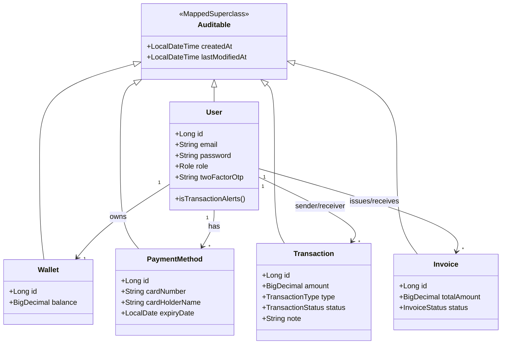
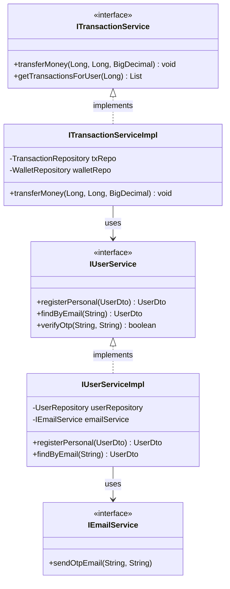
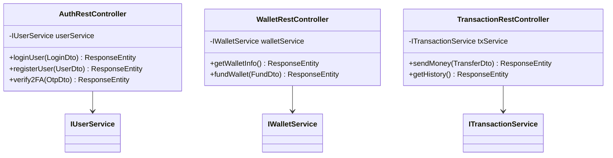

# Class Diagrams

The following class diagrams illustrate the internal object structures across different layers of RevPay application.

## 1. Entity (Domain) Model Diagram 
*This diagram highlights the core database entities and their relationships.*

## 2. Service Layer Class Diagram
*This diagram illustrates the separation of interface and implementation inside the business logic layer.*

## 3. Controller Layer Class Diagram
*This diagram details the REST endpoints managing incoming client HTTP requests.*

