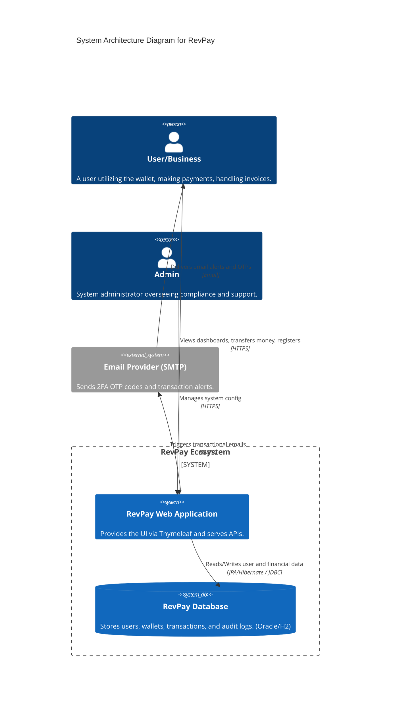

# System Architecture Diagram

This document illustrates the high-level system architecture of the RevPay application platform, including components, networks, and integration points.

## Component Details

### 1. Presentation & API Gateway (Web App)
- **Framework:** Spring Boot Web (Tomcat embedded).
- **Security:** Spring Security with JWT tokens for API and session-based auth for views. 2FA is validated here.
- **Role:** Routes requests, handles UI rendering with Thymeleaf, rate limiting.

### 2. Business Logic (Services)
- Coordinates multiple repositories to fulfill transactions atomically (`@Transactional`).
- Handles Email dispatch calls and DTO mapping.

### 3. Data Persistence (Database)
- Stores heavily structured relational data.
- **Framework:** Spring Data JPA with Hibernate.
- Soft-delete implemented for record preservation.

### 4. External Integrations
- **Email Service:** Utilizing Spring `JavaMailSender` connected to standard SMTP protocols to deliver OTP codes securely.
