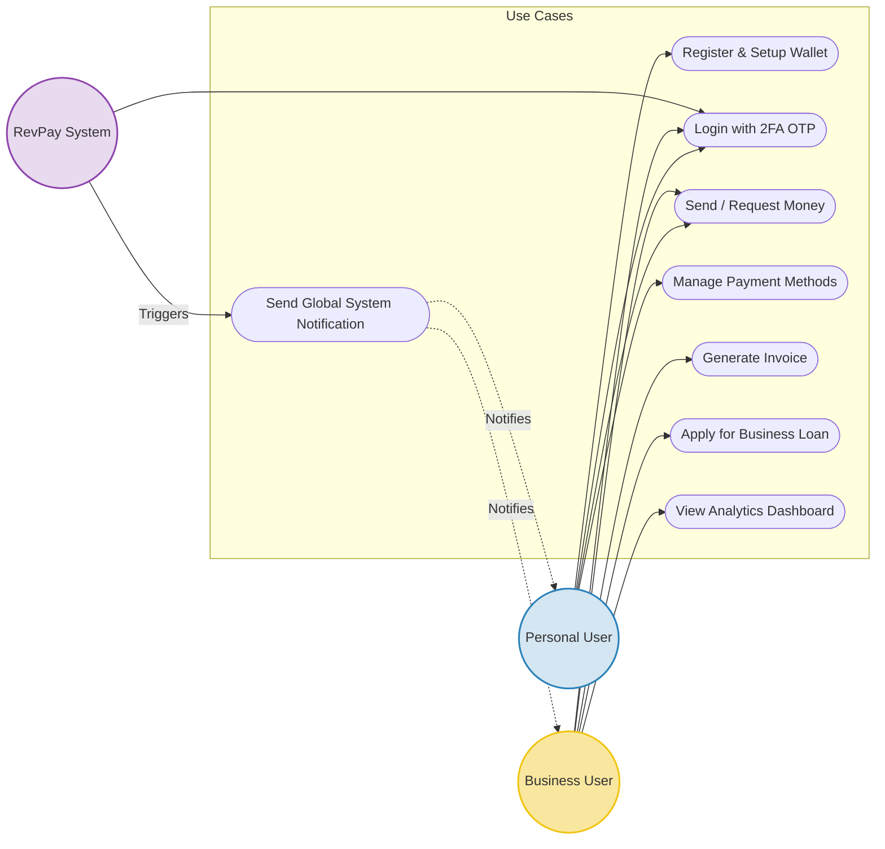

# Use Case Diagram

The following diagram defines the primary use cases and interaction flows per actor inside RevPay.

## Actor Descriptions

1. **Personal User:** Standard user who can register, login, link cards, and send/request money to friends.
2. **Business User:** Elevated user group that can issue invoices to clients, receive payments directly to their business wallet, view financial analytics, and apply for corporate loans.
3. **RevPay System:** Automated backend processes responsible for dispatching email alerts, processing scheduled tasks, and verifying OTP keys.
